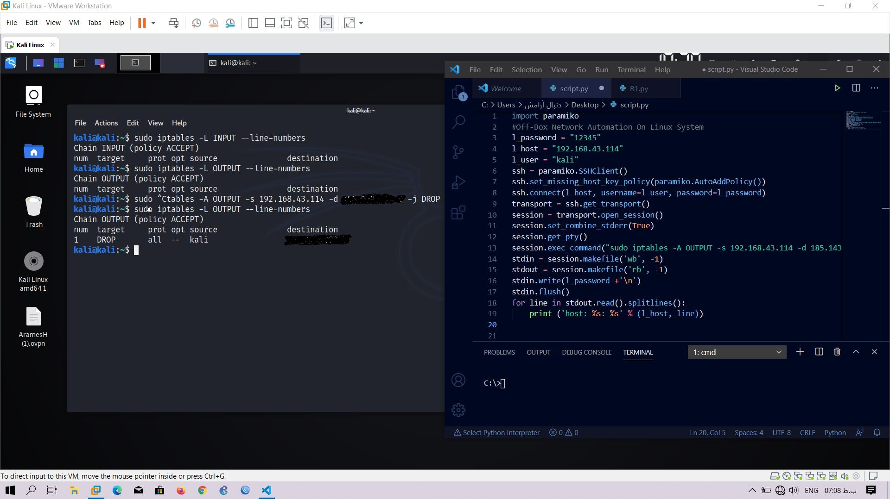

## Off-Box Network Automation On Linux Distributions

  

   
   
   
   
    

Sample Script For Off-Box Network Automation On Linux Distributions
Through This Script Network Engineers And System Adminstrators Have The Ability To Run Their Work Automated On MultiPle Linux Server And System Simultaneously
Note: This Script Is A Sample For Only Off-Box Network Automation On Linux Distributions And Not Work At Cisco And Other Platform
## Installation:
➜  ~ git clone https://github.com/AmirHoseinTangsiriNET/LinPyAuto/

➜  ~ cd LinAuto

➜  ~ pip3 install paramiko or pip3 install -r requirements.txt

➜  ~ python3 LinPyAuto.py

## Tutorial
### Video: https://youtu.be/KlTvqWpTDBg

## Prerequisite
* Python 3 
* Paramiko Module
* Introduction To Python Programming

  

